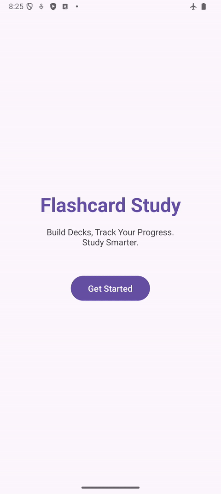
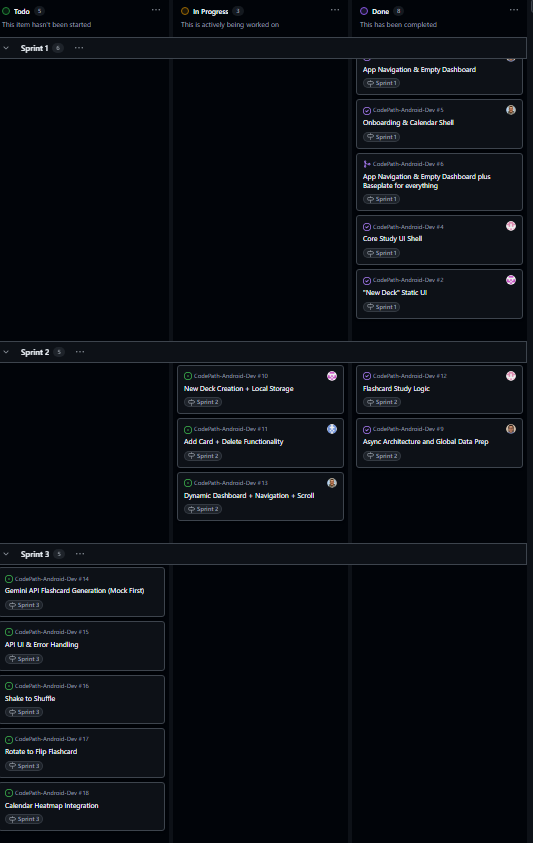

# Milestone 1 - Flashcard Study

## Table of Contents

1. [Overview](#Overview)
1. [Product Spec](#Product-Spec)
1. [Wireframes](#Wireframes)

## Overview

### Description

A focused flashcard app with study scheduling, progress tracking, a cram mode for last-minute sessions.

### App Evaluation

- **Category:** Education
- **Mobile:** Being mobile oriented is important since it provides convenience for studying on the go by matching the format of traditional flashcards.
- **Story:** Studying in a way that fits you is already difficult. Current systems like Quizlet and Anki are at times too complicated and too simple. This app aims to bridge the gap by providing a convenient and flexible platform to build decks, maintain study habits with a calendar, and shift into cram mode when time is limited.
- **Market:** High school and college students, self-learners
- **Habit:**  Users open the app daily to maintain a study streak. Users may also set certain intervals of study throughout a week.
- **Scope:**
    - V1: Create and manage decks, basic flashcard study flow with flip animation, and a calendar heatmap showing days studied.
    - V2: Progress tracking per deck. This will display how many cards are in "learning", "review", and "mastered" states. Cram mode that shuffles the full deck on repeat.
    - V3: Import and export system for flashcards for sharing decks between users and collaborative deck building.
    - V4: Streak rewards and study milestones, such as badges for hitting daily streaks, completing a full deck, or hitting a mastery threshold

## Product Spec

### 1. User Features (Required and Optional)

**Required Features**

1. [ ] User can create a "New Deck" by entering a name, selecting a color, choosing an icon, and toggling private/public visibility.
2. [ ] User can add a new card to a deck by entering "Front" and "Back" text, with options to "Save" or "Add Another card".
3. [x] User can tap a card to flip it over and reveal the back text (static/local study list).
4. [x]  User can grade their knowledge of a card after flipping it by selecting "Still learning" or "Got it" (local-only behavior).
5. [x] User can view a "Study History" screen featuring a monthly calendar grid.
6. [x] User can view a welcome/onboarding screen to get started with the app.
7. [x] User can view a Welcome screen with a "Get Started" button.
8. [x] User can navigate from the Welcome screen to the Dashboard.
9. [x] User can view a Dashboard screen with a visual layout of decks.
10. [x] User can see 2–3 mock deck cards displayed on the Dashboard (static UI).
12. [x] User can see a "Create Deck" button .
13. [x] User can navigate to the "Add Card" screen.
14. [x] User can view input fields for "Front" and "Back" text (UI shell).
15. [x] User can view a flashcard study screen UI.
16. [x] User can see a card with placeholder text / local mock questions.
18. [x] User can view a Calendar screen with a monthly grid layout (mock progress data).
20. [x] User can use bottom tab navigation to switch between main screens.

**Optional Features**

1. [ ] User can quickly resume their most recent deck from the "Continue Studying" widget on the home screen.
2. [ ] User can see the total card count for each deck directly on the home dashboard.
3. [ ] User can see individual color-coded indicators next to each card to quickly gauge mastery.
4. [ ] User can start a specialized "Cram" session instead of a standard study session.

## 2. Screen Archetypes

### Welcome / Onboarding Screen
- User can view a welcome/onboarding screen to get started with the app.

### Dashboard
- User can view a home dashboard displaying a grid of decks.
- User can see the total card count for each deck directly on the home dashboard. *(Optional)*
- User can quickly resume their most recent deck from the "Continue Studying" widget. *(Optional)*

### New Deck Screen
- User can create a "New Deck" by:
  - Entering a name
  - Selecting a color
  - Choosing an icon
  - Toggling private/public visibility

### Deck Detail Screen
- User can view a deck's cards.
- User can see individual color-coded indicators next to each card to gauge mastery. *(Optional)*
- User can choose to start studying or begin a "Cram" session. *(Cram = Optional)*

### Add Card Screen
- User can add a new card by:
  - Entering "Front" text
  - Entering "Back" text
- Options:
  - Save
  - Add another card

### Flash Card Section
- User can tap a card to flip and reveal the back.
- User can grade their knowledge:
  - "Still learning"
  - "Got it"

### Calendar Screen
- User can view a Study History screen featuring:
  - Monthly calendar grid
 
## 3. Navigation

### Tab Navigation (Tab to Screen)

- Dashboard
- Calendar
- New Deck

### Flow Navigation (Screen to Screen)

- Welcome / Onboarding Screen
  - => Dashboard

- Dashboard
  - => Deck Detail Screen (when user taps a deck)
  - => New Deck Screen (when user taps create button)
  - => Flash Card Section (via "Continue Studying") *(Optional)*

- New Deck Screen
  - => Dashboard (after creating a deck)

- Deck Detail Screen
  - => Add Card Screen (when user adds a card)
  - => Flash Card Section (when user starts studying)
  - => Flash Card Section (Cram mode) *(Optional)*

- Add Card Screen
  - => Deck Detail Screen (after saving)
  - => Add Card Screen (if user selects "Add another card")

- Flash Card Section
  - => Deck Detail Screen (after finishing studying)
  - => Dashboard (optional exit)

- Calendar Screen
  - => None, but user can tap a date to view detailed study session *(Optional)*

## Wireframes

 

 

# Milestone 2 - Build Sprint 1 (Unit 8)

## GitHub Project board

## Issue cards
Issues Completed this Sprint

Issues to Complete next Sprint

## Issues worked on this sprint

- The issues completed were "Add Card" Static UI, App Navigation & Empty Dashboard, Onboarding & Calendar Shell, Core Study UI Shell, "New Deck" Static UI.

 

# Milestone 3 - Build Sprint 2 (Unit 9)

## GitHub Project board

## Completed user stories

List the completed user stories from this unit
- Foundational architecture is set up with `Deck` and `Flashcard` core data models.
- `FlashcardRepository` + `MockFlashcardRepository` are implemented with temporary in-memory deck/card arrays.
- Asynchronous mock loading is implemented using coroutine `delay(...)` in repository fetch functions.
- Basic `HomeViewModel` and `StudyViewModel` are set up to expose repository data for Dashboard/Study integration.
- Bottom tab navigation icons are implemented for Home, New Deck, Add Card, Study, and Calendar.

List any pending user stories / any user stories you decided to cut from the original requirements
- User can create a "New Deck" with full functionality (name, color, icon, private/public behavior).
- User can add a new card to a deck with full save/add-another persistence flow.
- Optional stories (continue widget resume behavior, mastery indicators, cram mode) remain pending.
- Dashboard and Study screens are not fully wired to repository-backed ViewModel observers yet.

## App Demo Video

- Embed the YouTube/Vimeo link of your Completed Demo Day prep video
